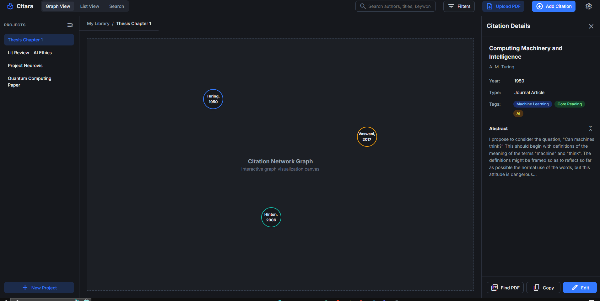
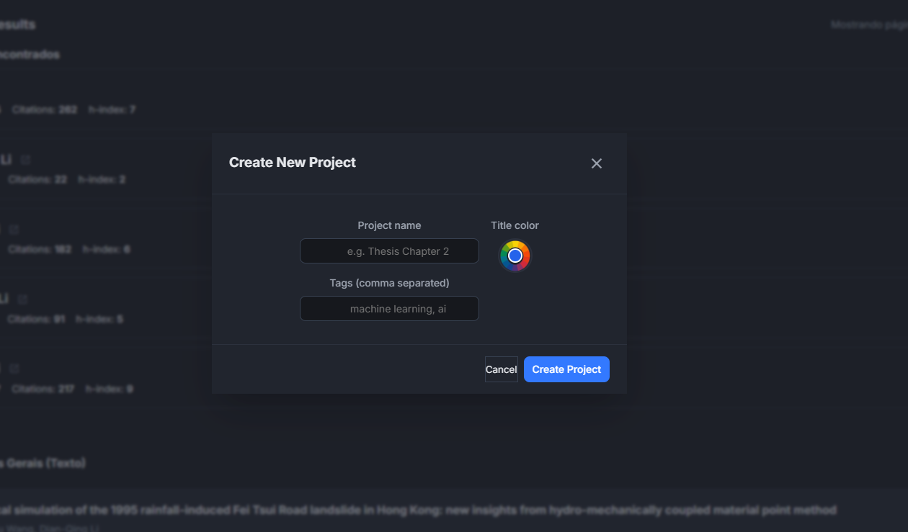
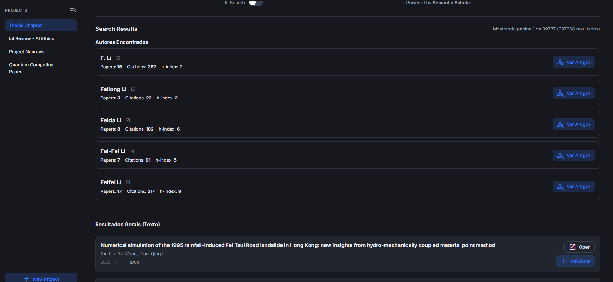
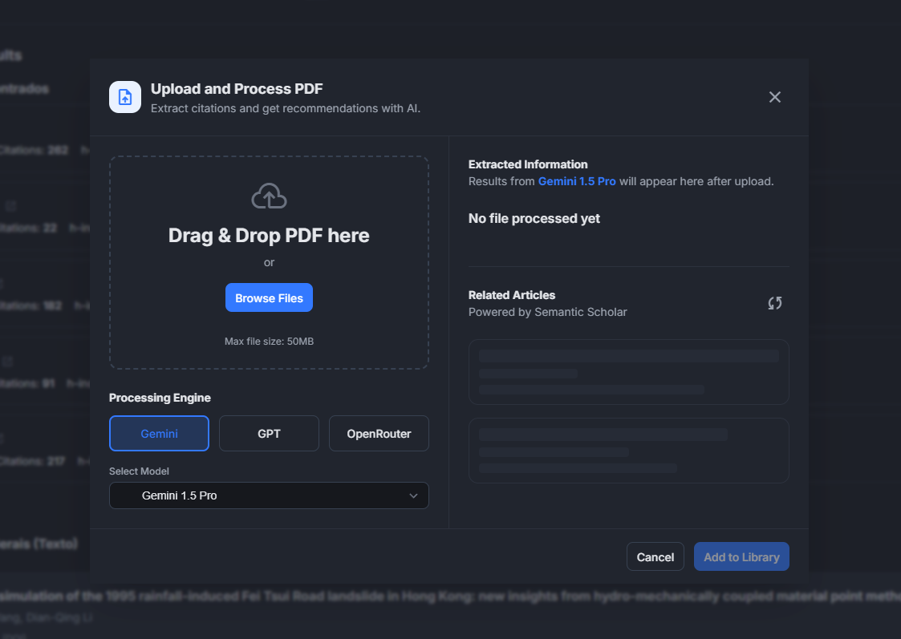
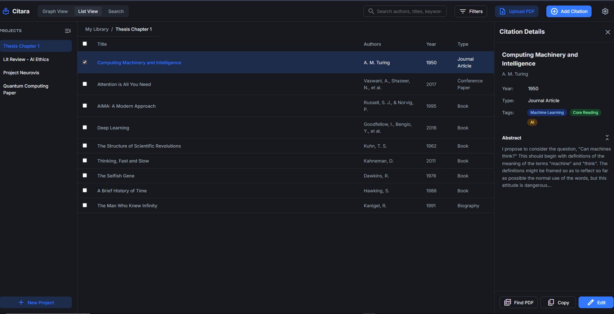

# Citara — Gerenciador de Referências Acadêmicas

Citara é uma aplicação front-end para organização de referências acadêmicas (PDFs e DOIs), busca de artigos e montagem de bibliografias. Desenvolvido na Imersão Dev da Alura com o objetivo de demonstrar habilidades de frontend e concorrer a uma bolsa na FIAP.

---

## Funcionalidades principais

- Busca de artigos via Semantic Scholar (integração direta pela API pública).
- Visualização em lista e grafo das referências para navegação e exploração de relações.
- Upload de PDFs com extração básica de metadados e edição manual.
- Filtros por autor, ano, palavras-chave e tags.
- Modais dinâmicos para adicionar/editar citações e gerenciar projetos.

---

## Ideia original (IA) e por que foi limitada

A proposta inicial previa um componente de IA atuando como "processador" central: usar um modelo generativo para enriquecer metadados, extrair citações diretamente do texto dos PDFs, sugerir referências e melhorar automaticamente os registros.

Na prática, essa integração ficou em estado experimental por dois motivos principais:

- **CORS e políticas de acesso**: chamadas diretas do navegador a serviços de IA e algumas APIs externas foram frequentemente bloqueadas por políticas CORS. Resolver isso de forma segura exige um backend/proxy para mediar requisições e proteger chaves de API.
- **Limites de uso e custos**: serviços de modelos gerativos normalmente requerem chaves, têm quotas e podem incorrer em custos; isso complica um fluxo público apenas client-side.

Como resultado, a funcionalidade de IA foi mantida como protótipo/feature experimental. O núcleo da aplicação (busca via Semantic Scholar, UI, upload e edição) permanece funcional sem essa camada.

---

## Problemas conhecidos

- Requisições a APIs externas podem falhar por CORS dependendo da origem (GitHub Pages pode funcionar se a API liberar a origem; em dev local pode bloquear).
- Chamadas a APIs públicas podem sofrer rate limiting ou mudanças de formato/contrato.
- Funcionalidades relacionadas à IA e exportadores (BibTeX/RIS) estão incompletas.
- Uploads e dados são mantidos localmente no navegador sem criptografia ou controle de acesso — não enviar dados sensíveis.

---

## Screenshots

<figure style="width:320px;margin:0;">

<figcaption style="font-size:0.9rem;color:#9ca3af;margin-top:6px;">Graph view</figcaption>
</figure>

<figure style="width:320px;margin:0;">

<figcaption style="font-size:0.9rem;color:#9ca3af;margin-top:6px;">Project list</figcaption>
</figure>

<figure style="width:320px;margin:0;">

<figcaption style="font-size:0.9rem;color:#9ca3af;margin-top:6px;">Search page</figcaption>
</figure>

<figure style="width:320px;margin:0;">

<figcaption style="font-size:0.9rem;color:#9ca3af;margin-top:6px;">Upload area</figcaption>
</figure>

<figure style="width:320px;margin:0;">

<figcaption style="font-size:0.9rem;color:#9ca3af;margin-top:6px;">List view</figcaption>
</figure>

---

## Roadmap / Próximos passos

- Mover integração de IA para um backend seguro (resolver CORS, esconder chaves, reduzir custos).
- Implementar autenticação e sincronização entre dispositivos/usuários.
- Melhorar o parser de PDF e adicionar exportadores (BibTeX, RIS, EndNote).

---

## Deploy no GitHub Pages.

